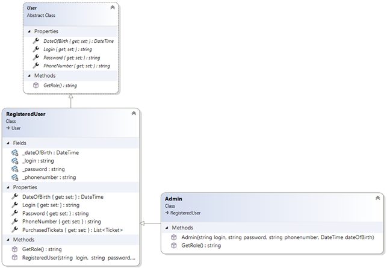
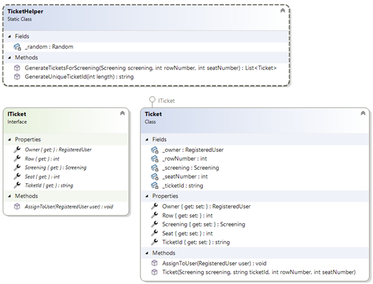
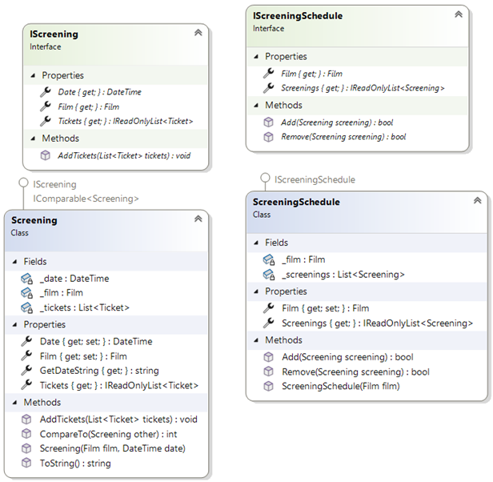
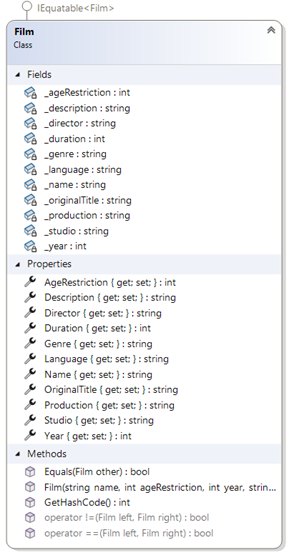
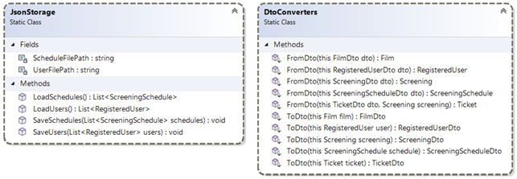
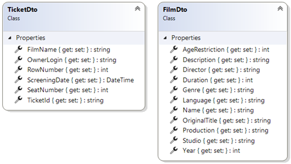
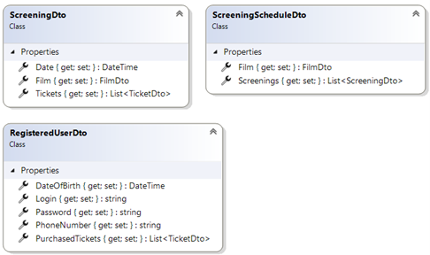

# Курсовий проєкт

## Вступ
Актуальність теми обумовлена потребою користувачів у зручному та швидкому способі перегляду розкладу кіносеансів, бронювання та купівлі квитків. Багато кінотеатрів вже мають власні цифрові платформи, проте не всі вони забезпечують достатній рівень зручності та функціональності. Розробка нового застосунку зі зручним інтерфейсом допоможе зробити процес відвідуваннякінотеатру ще комфортнішим.  
Потенційними користувачами цього застосунку є всі люди, які відвідують кінотеатри. Аналогічну аудиторію мають такі популярні сервіси, як "Планета Кіно" та "Multiplex", що свідчить про значний попит на подібні рішення.  
Серед основних лідерів ринку програмних аналогів в Україні можна виділити такі сервіси:  
Планета Кіно – одна з найвідоміших мереж кінотеатрів в Україні, що пропонує онлайн-замовлення квитків через веб-сайт та мобільний додаток.  
Multiplex – велика мережа кінотеатрів, яка має зручний інтерфейс для бронювання та купівлі квитків.  
У даному проєкті використовуються такі технології: мова програмування C#, фреймворк .NET 8, UI-технологія WPF для створення графічного інтерфейсу, а також GitHub для керування версіями. 

## Детальна діаграма класів предметної області
Нижче наведено детальну діаграму класів, яка була побудова з використанням Visual Studio 2022.

## Висновок

У результаті виконання курсового проєкту було розроблено програмне  забезпечення з використанням об’єктно-орієнтованої парадигми для створення сервісу з управління кінотеатром.  
У ході роботи було проаналізовано декілька аналогічних систем, що 
дозволило сформувати загальне бачення майбутнього застосунку. На основі 
цього аналізу було побудовано Mind map, у якому були визначені основні класи, 
ролі користувачів, їхні функціональні вимоги, а також основна ідея та логіка 
функціонування системи.  
Далі було спроєктовано інтерфейс користувача з урахуванням зручності 
взаємодії та створено функціональні тести, орієнтовані на ключові сценарії 
використання. Також було побудовано діаграму класів, яка слугувала основою 
для подальшої реалізації об’єктної моделі застосунку. 
Розробка системи виконувалась із застосуванням підходу розробки, 
керованої тестами (Test-Driven Development). На основі цих тестів було 
реалізовано повну функціональність класів таким чином, щоб усі тести успішно 
проходилися.  
Завершальним етапом стало створення повнофункціонального WPF-
застосунку, що включає підтримку декількох ролей користувачів, відображення 
розкладу сеансів, можливість замовлення квитків та адміністративне керування 
даними. Було проведене повне функціональне тестування створеного 
застосунку, що підтвердило відповідність програмного забезпечення вимогам, 
визначеним на етапі проєктування.  
Протягом усього процесу розробки використовувалася система контролю 
версій Git. Для зберігання вихідного коду було створено репозиторій, у якому 
регулярно фіксувалися зміни за допомогою комітів. 
